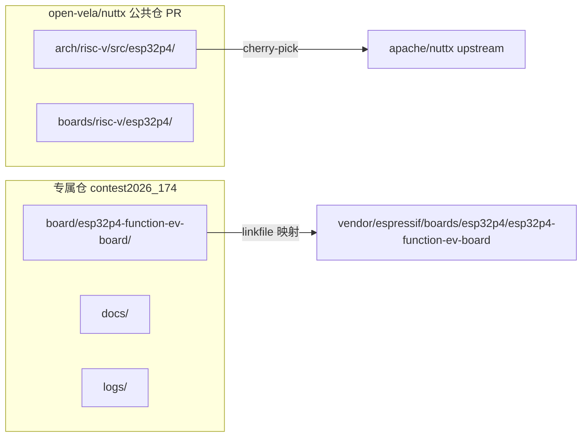

# ESP32-P4 OpenVela 系统适配设计文档

## 一、项目概述

将 openvela 操作系统适配到 ESP32-P4X-Function-EV-Board（乐鑫），完成从 BSP 移植、驱动开发到全功能系统构建的全链路适配工作。

### 目标硬件

- **开发板**：ESP32-P4X-Function-EV-Board
- **主控芯片**：ESP32-P4，双核 400MHz RISC-V + AI 加速
- **内存**：最大 32MB PSRAM
- **接口**：USB 2.0、MIPI-CSI/DSI、H264 编码
- **无线**：板载 ESP32-C6-MINI-1（Wi-Fi 6 + BLE 5）
- **显示**：7 寸 1024×600 触摸屏（MIPI-DSI）
- **摄像头**：200 万像素 MIPI CSI

### 赛道

2026 首届 openvela AI 硬件开发者大赛 — 新硬件适配赛道

### 当前进度

- NuttX upstream 已有 ESP32-P4 完整芯片层支持
- 本地 openvela 环境已完成基础适配，可编译烧录启动到 NSH 提示符

## 二、架构设计

### 代码提交路径

适配代码分为两个独立的提交路径：



### 三层架构映射

| 层次 | 代码位置 | 提交方式 |
|------|----------|----------|
| 架构层 | `nuttx/arch/risc-v/src/common/` | 已有，无需改动 |
| 芯片层 | `nuttx/arch/risc-v/src/esp32p4/` | 公共仓 PR（cherry-pick） |
| 板级层（NuttX） | `nuttx/boards/risc-v/esp32p4/esp32p4-function-ev-board/` | 公共仓 PR |
| 板级层（Vendor） | `contest2026_174.../board/esp32p4-function-ev-board/` | 专属仓 PR |


## 三、专属仓目录结构

```
contest2026_174_lvmoushouhuzhe/
├── board/
│   └── esp32p4-function-ev-board/          # vendor 板级适配（核心交付物）
│       ├── configs/
│       │   └── openvela/
│       │       └── defconfig               # openvela 专用 defconfig（L3 全功能）
│       ├── scripts/
│       │   └── Make.defs                   # 构建配置（工具链、链接脚本）
│       ├── CMakeLists.txt                  # CMake 入口（引用 NuttX board src）
│       ├── Kconfig                         # 板级可选配置项
│       └── README.md                       # 板级适配说明
├── quickapp/                               # 保留，后续 UI 应用开发
│   └── hello_quickapp/
├── logs/                                   # AI Coding 日志
├── docs/                                   # 设计文档、适配指南
│   ├── 2026-07-18-esp32p4-openvela-porting-design.md
│   └── porting_guide.md                    # 完整适配复现步骤
├── contest2026_174_lvmoushouhuzhe.xml      # manifest（修改 linkfile 映射）
├── openvela.xml
└── README.md                               # 作品说明
```

## 四、Manifest 配置

修改 `contest2026_174_lvmoushouhuzhe.xml`，调整 linkfile 映射：

```xml
<?xml version='1.0' encoding='UTF-8'?>
<manifest>
  <include name="openvela.xml"/>

  <project path="contest2026_174_lvmoushouhuzhe"
           name="contest2026_174_lvmoushouhuzhe">
    <!-- 板级适配：映射到 vendor/espressif 目录 -->
    <linkfile src="board/esp32p4-function-ev-board"
              dest="vendor/espressif/boards/esp32p4/esp32p4-function-ev-board"/>
    <!-- quickapp：保留供后续 UI 应用开发 -->
    <linkfile src="quickapp/hello_quickapp"
              dest="packages/apps/contest2026_174_hello_quickapp"/>
  </project>
</manifest>
```

## 五、公共仓 PR 计划

### PR1: ESP32-P4 芯片层支持

- **目标仓**：`open-vela/nuttx` → `dev-ai-contest-2026` 分支
- **内容**：
  - `arch/risc-v/src/esp32p4/`（含 esp-hal-3rdparty submodule）
  - Kconfig、Make.defs、CMakeLists.txt
  - 芯片启动、中断、串口、定时器等核心代码
- **来源**：cherry-pick from apache/nuttx
- **额外修改**：MIPI CSI/DSI 驱动、Camera 支持、esp-hal-3rdparty 补丁

### PR2: ESP32-P4 板级公共代码

- **目标仓**：`open-vela/nuttx` → `dev-ai-contest-2026` 分支
- **内容**：
  - `boards/risc-v/esp32p4/common/`
  - `boards/risc-v/esp32p4/esp32p4-function-ev-board/`（NuttX 板级源码）
- **来源**：cherry-pick from apache/nuttx + 本地增量修改


## 六、L3 全功能适配路线图

### 阶段 L0：最小系统启动（已完成）

| 组件 | 状态 | 说明 |
|------|------|------|
| RISC-V 架构支持 | ✅ | 双核 400MHz |
| USB Serial Console | ✅ | ESP32-P4 原生 USB 2.0 OTG |
| NSH Shell | ✅ | 启动到命令行提示符 |
| 基础内存管理 | ✅ | 内部 SRAM |

### 阶段 L1：基础外设

| 组件 | defconfig 关键项 | 验证命令 |
|------|-----------------|----------|
| GPIO | `CONFIG_DEV_GPIO=y` | `gpio` 命令读写引脚 |
| Timer | `CONFIG_TIMER=y` | `timer` 测试 |
| Watchdog | `CONFIG_WATCHDOG=y` | `wdog` 测试 |
| I2C | `CONFIG_I2C_DRIVER=y`, `CONFIG_SYSTEM_I2CTOOL=y` | `i2ctool` 扫描 |
| SPI | `CONFIG_ESPRESSIF_SPI2=y` | SPI 设备通信 |
| RTC | `CONFIG_RTC_DRIVER=y` | `date` 命令 |

### 阶段 L2：高级外设

| 组件 | defconfig 关键项 | 验证方式 |
|------|-----------------|----------|
| PSRAM | `CONFIG_ESP32P4_SPIRAM=y` | `free` 显示扩展内存 |
| SPI Flash | `CONFIG_ESPRESSIF_SPIFLASH=y` | 文件系统挂载 |
| Ethernet | `CONFIG_ESPRESSIF_EMAC=y`, `CONFIG_NET=y` | `ping` 测试 |
| MIPI-DSI LCD | LCD/FB 相关配置 | LVGL demo 显示 |
| MIPI-CSI Camera | Camera 相关配置 | 图像采集 |
| LEDC/PWM | `CONFIG_ESPRESSIF_LEDC=y` | PWM 输出验证 |
| ADC | `CONFIG_ESPRESSIF_ADC=y` | 模拟量采集 |

### 阶段 L3：全功能

| 组件 | defconfig 关键项 | 验证方式 |
|------|-----------------|----------|
| Wi-Fi（via ESP32-C6） | Wi-Fi 相关配置 | `wapi` 连接 AP |
| BLE（via ESP32-C6） | BLE 相关配置 | 蓝牙扫描 |
| USB 2.0 Host/Device | USB 相关配置 | USB 设备枚举 |
| TWAI (CAN) | `CONFIG_ESPRESSIF_TWAI=y` | CAN 总线通信 |
| 触摸屏输入 | Input 相关配置 | 触摸事件上报 |
| AI 加速器 | 待确认 | AI 推理 demo |

## 七、关键技术决策

| 决策项 | 选择 | 理由 |
|--------|------|------|
| 构建系统 | CMake | openvela 推荐，ESP32-P4 upstream 也用 CMake |
| 控制台 | USB Serial | ESP32-P4 原生 USB OTG，无需额外芯片 |
| Wi-Fi 路径 | SPI/SDIO 桥接 ESP32-C6 | P4 本身无射频，通过板载 C6 子模块实现 |
| 代码参考优先级 | openvela 本地 > NuttX upstream > ESP-IDF | 确保与 openvela 框架兼容 |
| 板级目录命名 | `esp32p4-function-ev-board` | 与 upstream 一致，便于获奖后直接 PR |
| defconfig 命名 | `openvela` | 区分 upstream 的 `nsh` 配置 |

## 八、构建与烧录

### 构建命令

```bash
# 进入 openvela 工作区根目录
cd /path/to/openvela_workspace

# CMake 构建
./build.sh vendor/espressif/boards/esp32p4/esp32p4-function-ev-board/configs/openvela --cmake -j8
```

### 烧录方式

使用乐鑫 esptool 或 EIM CLI 工具通过 USB 烧录：

```bash
# 使用 esptool
esptool.py --chip esp32p4 write_flash 0x0 vela_ap.bin

# 或使用 EIM CLI
eim flash --chip esp32p4 --port /dev/ttyACMx
```

## 九、评分优势分析

| 评分维度 | 对应工作 |
|----------|----------|
| 技术难度（30分） | 全新 RISC-V 架构适配 + 丰富外设驱动（MIPI CSI/DSI、Wi-Fi、BLE） |
| 外设覆盖 | GPIO/SPI/I2C/Timer/WDG/PSRAM/Flash/ETH/LCD/Camera/Wi-Fi/BLE/USB |
| 应用 Demo | LVGL 显示、Camera 采集、网络通信 |
| 代码质量 | 遵循 openvela vendor 规范，可直接合入主线 |
| 文档完整性 | 完整适配指南，评委可复现 |
| AI 辅助开发 | AI Coding 日志记录全过程 |

## 十、风险与应对

| 风险 | 影响 | 应对措施 |
|------|------|----------|
| 公共仓 PR 未被合入 | 评委无法编译 | README 中提供完整的手动 cherry-pick 步骤 |
| Wi-Fi 驱动复杂度高 | L3 可能无法完成 | 优先确保 L2 完整，Wi-Fi 作为加分项 |
| esp-hal-3rdparty 版本冲突 | 编译失败 | 记录精确 commit hash + patch |
| MIPI-DSI/CSI 硬件调试 | 显示/摄像头不工作 | 先验证 framebuffer stub，再接真实硬件 |
